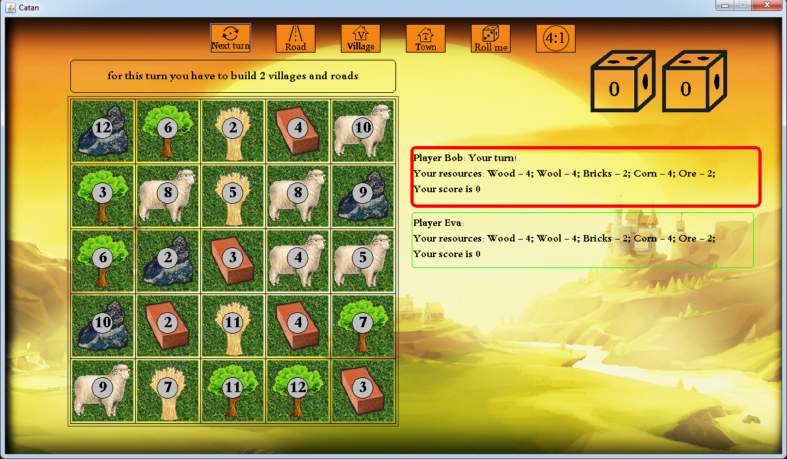
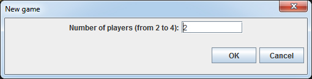
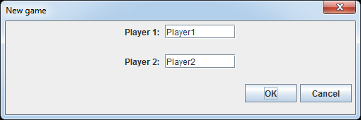
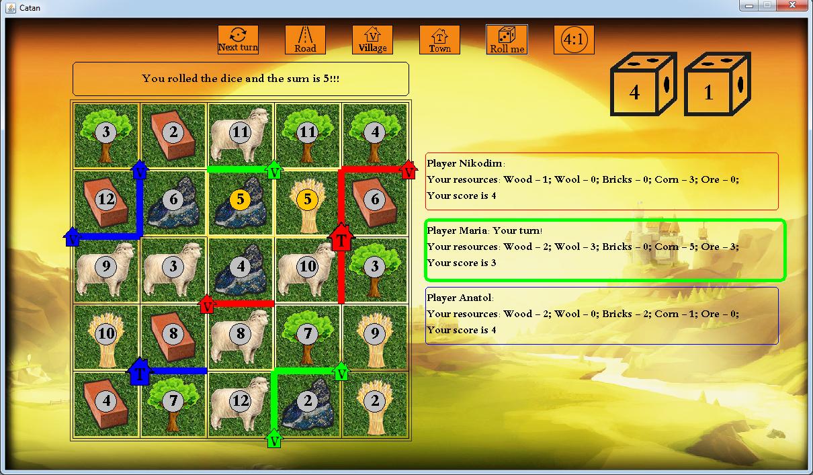

# Catan_v2.0
Catan game for PC, which i made as my school project



The implementation of the popular Catan board game on PC

# How to install and play
## First way (Preferred)
1. Download ```.jar```-file last version [from here](https://github.com/artemNasonov/Catan_v2.0/blob/master/Catan_v2.0.jar "Link to root of the project, yeah")
2. Run it on your PC. **Java 8 must be installed on your PC; if it isn't, you can download it [from here](https://www.oracle.com/technetwork/java/javase/downloads/jdk8-downloads-2133151.html)**
## Second way
1. Download all project
2. Import it to [Intellij IDEA](https://www.jetbrains.com/idea/) or another development environment (it could be your console)))
3. Run game from your development environment
# How to start playing
1. When you start the game, enter the data on the number of players, and then their names
2. Enjoy the game)
# Rules
* Village: gives you 1 victory point and one unit of raw materials from the surrounding fields. It costs 1 brick + 1 wood + 1 wool + 1 corn
  * **Attention! Don't forget about rule of distance! You can build a village at a free crossroads, if none of the neighboring crossroads 
    has villas or cities**
  * To build village chose it with button ```Village``` and click on the crossroad, where you want to build it. You can build village only 
    if road approaches her.
* Town: gives you 2 victory point and two units of raw materials from the surrounding fields. To upgrade villge to town you 
  must pay 2 corn + 3 ore
  * To upgrade village to town chose town with button ```Town``` and click on the village you want to upgrade
* Road: Connects two crossroads, starts from village/town. One road costs 1 brick + 1 wood.
  They can intersects, but they sholdn't overlap
  * To build road chose it with button ```Road``` and click on the crossroad where you want to start and then on crossroad where you want 
    to end.
* Resource sharing: You can change 4 raw material cards of one type to 1 raw material card of another type.
  * To open exchange bar click on button ```4:1```. In the window that appears, select the type of resource that you are changing and 
    that you want to receive in return. Click ```confirm``` to confirm, ```cancel``` to cancel.
* Rolling the dice: villages and towns that are adjacent to the field with a number equal to the sum of points on the cubes, 
  receive raw materials.
  * To roll the dice click button ```Roll the dice```.
* You can build you can build as much as you like as long as you have the resources. When you understand, that you want to complete the
  move,  do it.
  * To complete the move click on button ```Complete the move```.
# Screenshots
+ Initialization window: 
+ Initialization window: 
+ Game process: 
